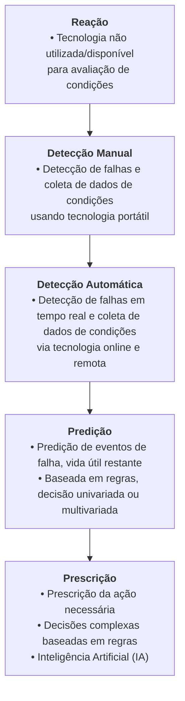
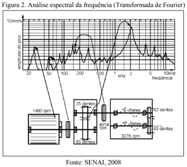
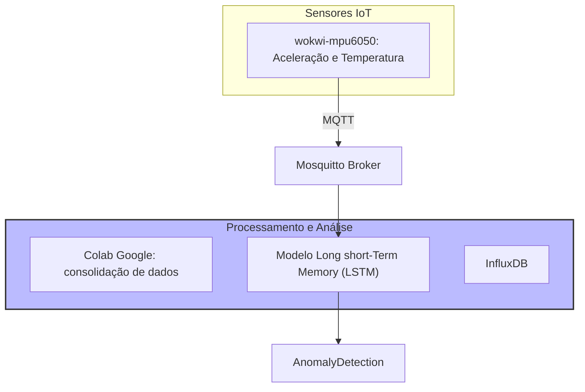
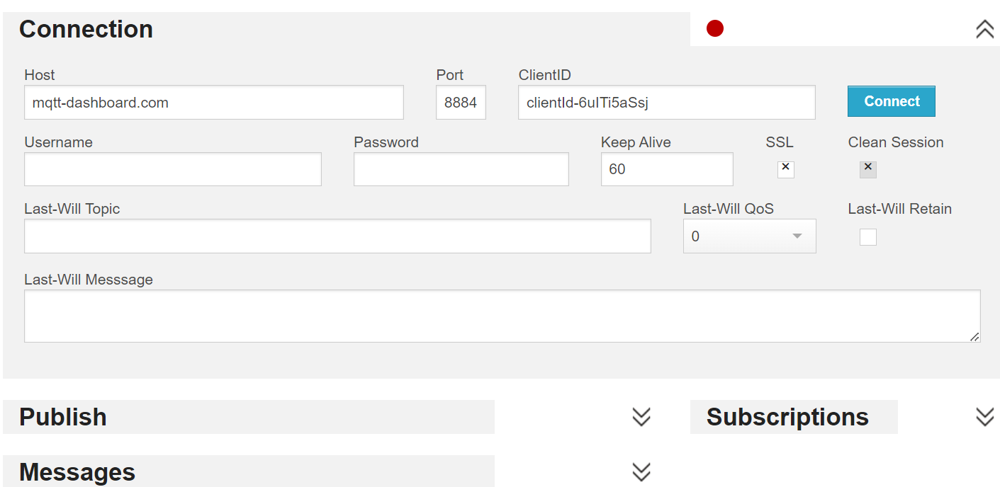

Autor: Anthon Pedrollo Hax

    Tópico 7: Protocolos de Comunicação IoT Industrial e sua integração com a Nuvem; protocolos MQTT, OPC-UA e Modbus e sua integração com computação em nuvem para aplicações industriais.

https://www.ece.ufrgs.br/~jmgomes/pid/Apostila/apostila/apostila.html

### MQTT
Utilização Iot para Manutenção Preditiva, isso é, utilizar IA e sensores para poder prever falhas em equipamentos via MQTT;

Segundo GOEBEL (2024), Estima-se que o número de dispositivos IoT conectados tenha aumentado 18%, alcançando 14,4 bilhões globalmente até o final de 2022, com projeções indicando cerca de 27 bilhões de dispositivos até 2025. O protocolo MQTT (Message Queuing Telemetry Transport) se destaca como um padrão amplamente adotado para comunicação IoT e M2M. Desenvolvido inicialmente para atender à necessidade de comunicação eficiente entre dispositivos remotos com largura de banda limitada e recursos de processamento restritos, o MQTT utiliza um modelo de transporte de mensagens de publicação/assinatura. 

MQTT permite que dispositivos publiquem mensagens em tópicos específicos, com todos os dispositivos assinantes recebendo as mensagens publicadas. A simplicidade e a leveza do MQTT o tornam ideal para uma variedade de aplicações em setores como automotivo, manufatura e telecomunicações. A arquitetura do MQTT é composta por dois elementos principais: clientes e brokers. Os clientes são dispositivos ou aplicativos que podem publicar ou assinar mensagens, enquanto os brokers atuam como servidores intermediários, roteando mensagens entre os clientes. Os brokers gerenciam a distribuição das mensagens, mantendo o controle sobre as assinaturas e garantindo que as mensagens sejam entregues de forma eficiente. 

O MQTT se revela particularmente útil em diversas aplicações IoT e IIoT (Internet Industrial das Coisas), coletando dados de sensores em ambientes remotos e para monitorar a saúde de máquinas, garantindo a entrega confiável de dados críticos antes mesmo de chegarem a um centro de dados. Implementações de brokers MQTT estão disponíveis em plataformas como HiveMQ, Mosquitto e serviços de nuvem como AWS IoT e Azure IoT.

### Uso de Machine Learning em Manutenção
> IA + Manutenção https://tractian.com/

Manutenção preditiva é a ação de monitorar a condição de um ativo e prever a necessidade de ação preventiva ou corretiva. (GFMAM, 2021) 

Atualmente , a tecnologia evoluiu de maneira a não apenas detectar falhas mas prever falhas e vida útil restante usando lógica programável e inteligência artificial, recomendando ações corretivas apropriadas. Segundo KANE et al. (2022), Manutenção Preditiva (PdM) é uma abordagem inovadora que utiliza técnicas baseadas em dados para gerenciar eficientemente os planos de manutenção de ativos, prevendo falhas antes que ocorram. Na indústria, a coleta contínua de dados sobre o estado dos equipamentos permite identificar padrões e correlações que podem prever e, portanto, prevenir falhas. Se utilizada corretamente pode reduzir o custo de inatividade e melhorar a disponibilidade dos equipamentos.

Segundo KANE et al. (2022) a análise da inatividade de máquinas é crucial, pois pode representar uma perda de 5% a 20% na produtividade das indústrias, além de gerar custos exorbitantes com manutenção. As técnicas de aprendizado de máquina (ML) são ferramentas valiosas para examinar dados históricos, identificar padrões de degradação e prever falhas potenciais. 

Em seu estudo, KANE et al. (2022) propõe a utilização de dados coletados por sensores de uma máquina de tubulação, com o objetivo de realizar uma limpeza de dados e identificar correlações entre parâmetros que afetam a operação da máquina. A partir da análise desses dados, o trabalho busca identificar e treinar o modelo de aprendizado de máquina mais adequado para prever falhas. A coleta contínua de dados por sensores permite um agendamento de manutenção mais adequado, reduzindo o tempo de inatividade e os custos associados. A eficácia do modelo foi demonstrada na previsão de períodos de parada com base em dados históricos, destacando sua importância na manutenção da produtividade e na minimização dos custos operacionais.

O uso de modelos de aprendizado de máquina, como redes neurais do tipo LSTM (Long Short-Term Memory), tem se mostrado eficaz na previsão de falhas, uma vez que esses modelos podem processar sequências de dados e aprender padrões complexos ao longo do tempo. A capacidade dos LSTMs de manter informações por períodos prolongados os torna especialmente úteis na identificação de falhas antes que elas causem paradas.

Segundo FARIAS (2024) com a Internet das Coisas (IoT) e utilização de sensores inteligentes, é possível conectar equipamentos e permitir uma visão global e em tempo real de todas as operações, para tomadas  de decisão mais fundamentadas e planejadas. Ademais, esses sensores permitem ainda a coleta  de dados necessários para o planejamento da manutenção, uma vez que a previsão de falhas é  essencial ao agendamento de intervenções para evitar paralisações não planejadas.

Nesse caso o autor está se referindo a medição via Transformada de Fourier a vibração de máquinas em MegaHertz/segundo dispostos em uma série temporal, que pode indicar anomalias de padrões vibratórios e assim a detecção de problemas mecânicos precocemente.

# Protótipo MQTT (Message Queuing Telemetry Transport)

Utilizando HiveMq é possível montar um broker de MQTT que capta informações públicas via assinatura de tópicos, a partir disso é possível construir um modelo de treinamento de Machine Learning capaz de identificar desvios, onde:

> *Publicadores* (Publisher) enviam mensagens para tópicos específicos.
> *Assinantes* (Subscriber) recebem mensagens de tópicos aos quais estão inscritos.
> *Broker* gerencia a comunicação entre publicadores e assinantes.

Fonte: FARIAS (2024)

Segundo FARIAS (2024), ao analisar o espectro da frequência, os picos demonstram problemas específicos de cada componente, ou seja, cada problema induz um padrão de vibração em frequências diferentes. Cada pico de frequência indica uma origem de problema diversa e, com isso, ao identificar o problema específico, a equipe de manutenção poderá atuar de forma proativa, de acordo com o planejamento correto, sem necessidade de paradas não programadas.   

Abaixo está um diagrama com a ideia de prototipação:

### Ferramentas utilizadas:

> Broker + public data

Cluster Serveless HiveMQ Cloud (TLS) + Kafka

Visualização de dados: Apache Superset, Metabase, Redash, Grafana
> https://www.ibm.com/products/cognos-analytics     

## Referências

GOEBEL, T. What Is MQTT? Disponível em: <https://www.twilio.com/en-us/blog/what-is-mqtt>. 2024.

KANE, Archit et al. (2022). Predictive Maintenance using Machine Learning. 10.48550/arXiv.2205.09402. 

GFMAM -  Global Forum on Maintenance and Asset Management. The Maintenance Framework Second Edition. [s.l: s.n.]. Disponível em: <https://gfmam.org/sites/default/files/2021-02/GFMAM%20Maintenance%20Framework%20-%202nd%20Edition%20Final.pdf?token=blXRtXOZx9Mn0Vw0r15ZEEJDFcPZIWmgywL6TGoFOKc>. Acesso em: 4 set. 2024.

Farias, Pablo. (2024). Mineração 4.0: otimização da manutenção preditiva através da análise de vibração. CONTRIBUCIONES A LAS CIENCIAS SOCIALES. 17. e6690. 10.55905/revconv.17n.5-056. 

# IIOT

https://www.emqx.com/en/blog/iiot-explained-examples-technologies-benefits-and-challenges

https://www.hivemq.com/blog/mqtt-sn-smart-choice-for-iiot/

https://www.emqx.com/en/blog/the-smart-manufacturing-revolution

# Public Broker Alternatives
https://www.cloudamqp.com/
