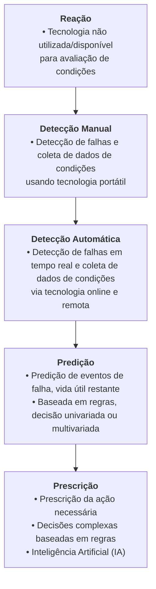
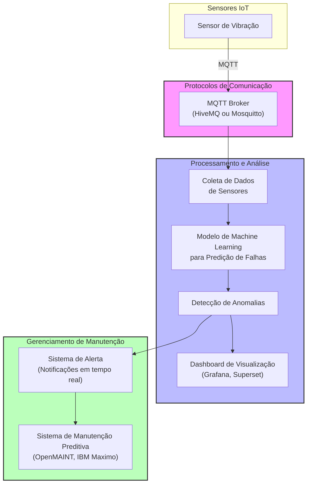

Autor: Anthon Pedrollo Hax

Tópico 7: Protocolos de Comunicação IoT Industrial e sua integração com a Nuvem; protocolos MQTT, OPC-UA e Modbus e sua integração com computação em nuvem para aplicações industriais.

### Ideia de Tema
    Utilização Iot para Manutenção Preditiva, isso é, utilizar IA e sensores para poder prever falhas em equipamentos;

    > IA + Manutenção https://tractian.com/

    Gerenciamento de manutenção e ativos:
    OpenMAINT, Snipe-IT, CMMS.io, Maintenance Assistant
    > exemplo [IBM Maximo: King Khalid International Airport](https://www.ibm.com/blog/the-skys-the-limit-for-airport-maintenance/)

    Visualização de dados: Apache Superset, Metabase, Redash, Grafana
    > https://www.ibm.com/products/cognos-analytics

### To do
    - Encontrar dados mockados de máquinas industriais (MQTT);
    - Realizar um recorte em indústria;
    - Avaliar maneiras de montar um protótipo de predição;

Existem diversos padrões de comunicação de dados na indústria, e o que é buscado principalmente neste tipo de infraestrutura de comunicação é confiabilidade e robustez. Abaixo são explorados alguns protocolos utilizados nesse contexto: MQTT, OPC-UA e Modbus.

# Manutenção Preditiva

Manutenção preditiva é a ação de monitorar a condição de um ativo e prever a necessidade de ação preventiva ou corretiva. (GFMAM, 2021) 

Atualmente , a tecnologia evoluiu de maneira a não apenas detectar falhas mas prever falhas e vida útil restante usando lógica programável e inteligência artificial, recomendando ações corretivas apropriadas.

GFMAM -  Global Forum on Maintenance and Asset Management. The Maintenance Framework Second Edition. [s.l: s.n.]. Disponível em: <https://gfmam.org/sites/default/files/2021-02/GFMAM%20Maintenance%20Framework%20-%202nd%20Edition%20Final.pdf?token=blXRtXOZx9Mn0Vw0r15ZEEJDFcPZIWmgywL6TGoFOKc>. Acesso em: 4 set. 2024.

Segundo FARIAS (2024)
    Com a Internet das Coisas (IoT) e utilização de sensores inteligentes, é possível conectar equipamentos e permitir uma visão global e em tempo real de todas as operações, para tomadas  de decisão mais fundamentadas e planejadas. Ademais, esses sensores permitem ainda a coleta  de dados necessários para o planejamento da manutenção, uma vez que a previsão de falhas é  essencial ao agendamento de intervenções para evitar paralisações não planejadas.

Nesse caso o autor está se referindo a medição via Transformada de Fourier a vibração de máquinas em MegaHertz/segundo dispostos em uma série temporal, que pode indicar anomalias de padrões vibratórios e assim a detecção de problemas mecânicos precocemente.

# Protótipo MQTT (Message Queuing Telemetry Transport)

Utilizando HiveMq é possível montar um broker de MQTT que capta informações públicas via assinatura de tópicos, a partir disso é possível construir um modelo de treinamento de Machine Learning capaz de identificar desvios, onde:

*Publicadores* (Publisher) enviam mensagens para tópicos específicos.
*Assinantes* (Subscriber) recebem mensagens de tópicos aos quais estão inscritos.
*Broker* gerencia a comunicação entre publicadores e assinantes

- mosquitto, hivemq

