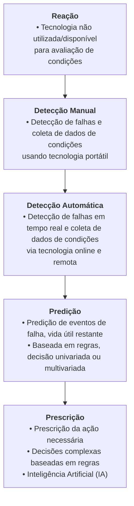

Autor: Anthon Pedrollo Hax

Tópico 7: Protocolos de Comunicação IoT Industrial e sua integração com a Nuvem; protocolos MQTT, OPC-UA e Modbus e sua integração com computação em nuvem para aplicações industriais.

### Ideia de Tema
    Utilização Iot para Manutenção Preditiva, isso é, utilizar IA e sensores para poder prever falhas em equipamentos;

    > IA + Manutenção https://tractian.com/

    Gerenciamento de manutenção e ativos:
    OpenMAINT, Snipe-IT, CMMS.io, Maintenance Assistant
    > exemplo [IBM Maximo: King Khalid International Airport](https://www.ibm.com/blog/the-skys-the-limit-for-airport-maintenance/)

    Visualização de dados: Apache Superset, Metabase, Redash, Grafana
    > https://www.ibm.com/products/cognos-analytics

### To do
    - Encontrar dados mockados de máquinas industriais (MQTT);
    - Realizar um recorte em indústria;
    - Avaliar maneiras de montar um protótipo de predição;

Existem diversos padrões de comunicação de dados na indústria, e o que é buscado principalmente neste tipo de infraestrutura de comunicação é confiabilidade e robustez. Abaixo são explorados alguns protocolos utilizados nesse contexto: MQTT, OPC-UA e Modbus.

# Manutenção Preditiva

Manutenção preditiva é a ação de monitorar a condição de um ativo e prever a necessidade de ação preventiva ou corretiva. (GFMAM, 2021)

GFMAM -  Global Forum on Maintenance and Asset Management. The Maintenance Framework Second Edition. [s.l: s.n.]. Disponível em: <https://gfmam.org/sites/default/files/2021-02/GFMAM%20Maintenance%20Framework%20-%202nd%20Edition%20Final.pdf?token=blXRtXOZx9Mn0Vw0r15ZEEJDFcPZIWmgywL6TGoFOKc>. Acesso em: 4 set. 2024.

‌

Manutenção preditiva baseia-se em um monitoramento e diagnóstico em tempo
real de equipamentos, processos e cadeias produtivas, com o propósito de agir
quando estes apresentarem situações que possam resultar em falha, quebra,
redução de desempenho, diminuição da segurança aos operadores ou afetar o
controle de qualidade de um produto. 

# MQTT ( Message Queuing Telemetry Transport)

modelo de publicação/assinatura, onde:

*Publicadores* (Publisher) enviam mensagens para tópicos específicos.
*Assinantes* (Subscriber) recebem mensagens de tópicos aos quais estão inscritos.
*Broker* gerencia a comunicação entre publicadores e assinantes

- mosquitto, hivemq

# OPC-UA (OPC Foundation Unified Architecture)

# <https://github.com/OPCFoundation>

Plataforma independente: OPC-UA pode ser implementado em diferentes sistemas operacionais e hardware, garantindo interoperabilidade entre dispositivos de diferentes fabricantes.

Segurança: O protocolo oferece funcionalidades avançadas de segurança, incluindo autenticação, criptografia e controle de acesso, garantindo que as comunicações sejam seguras.

Modelo de informação rico: OPC-UA suporta uma estrutura de dados complexa, permitindo a modelagem de informações detalhadas sobre os dispositivos e processos, o que facilita a integração de sistemas.

Comunicação escalável: OPC-UA pode ser usado em vários níveis de uma infraestrutura industrial, desde sensores e controladores até sistemas de gerenciamento e supervisão, oferecendo uma solução de comunicação escalável.

Suporte para várias plataformas e linguagens: O protocolo é amplamente adotado em sistemas de automação e está disponível em diversas linguagens de programação, facilitando a integração em diferentes ambientes de desenvolvimento.

# Modbus

- Estrutura Master / Slave (nome péssimo, diz respeito a uso de memória de processamentos de terceiros)

Protocolos de Transmissão:

 RTU: Usa comunicação serial (RS-232, RS-485) e é o formato mais comum, empregando uma estrutura de dados compacta e eficiente.

 ASCII: Similar ao Modbus RTU, mas usa uma representação de dados ASCII, que é mais fácil de ler, mas menos eficiente.

 TCP/IP: Adaptado para redes Ethernet, permitindo que o Modbus seja usado em redes modernas de TI, além das tradicionais conexões seriais.

- padrões físicos RS-232 (Recommended Standard 232), RS-485 (Recommended Standard 485), EIA-485 (Electronic Industries Alliance-485) e Ethernet TCP/IP.

Conexão ponto-a-ponto de velocidade média de 115 Kbps ou taxas um pouco maiores.

A distância máxima entre os dispositivos da rede está em torno de 30m.

<https://embarcados.com.br/protocolo-modbus/>
